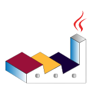
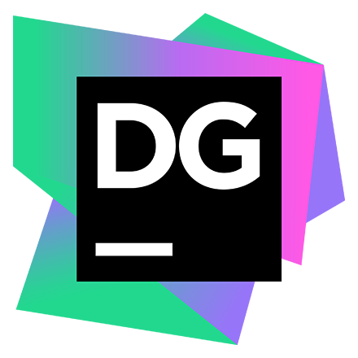

# Hi there, I'm Lorenzo 👋 

###  French

<h3>🎓 Engineering student in Computer Science and Management</h3>

###   Studying at Polytech Montpellier, France

<h3>📍 Montpellier, France</h3>

---

# Connect with me

--- 

# Languages and Tools:

<h3>Programming languages</h3>

  

  

    

  

  
 
 
<h3>Web programming (front and back)</h3>

 
 
<h3>Database</h3>

 
 
<h3>Tools</h3>

<a href="https://en.wikipedia.org/wiki/Bash_(Unix_shell)" target="blank">#gh-light-mode-only
  
</a>

<!--
---

# My most used languages

-->

<!--
sources:

https://github.com/simple-icons/simple-icons

https://simpleicons.org/

https://github.com/Ileriayo/markdown-badges#badges

https://github.com/alexandresanlim/Badges4-README.md-Profile

https://github.com/martonlederer/martonlederer

https://github.com/abhisheknaiidu/awesome-github-profile-readme#game-mode-

-->
